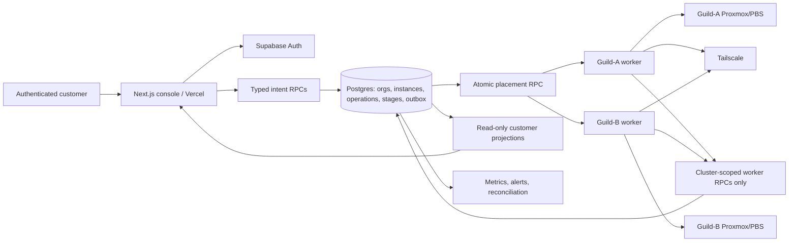

# GuildCloud Platform Hardening and Launch Implementation Plan

> **For agentic workers:** REQUIRED SUB-SKILL: Use superpowers:subagent-driven-development (recommended) or superpowers:executing-plans to implement this plan task-by-task. Steps use checkbox (`- [ ]`) syntax for tracking.

**Goal:** Turn the existing GuildCloud private VPS control plane into an honest, recoverable, secure, and operable production service without rewriting the working Next.js, Supabase, Proxmox, or Tailscale foundations.

**Architecture:** Keep the Vercel-hosted Next.js console and Supabase control plane as the customer-facing authority. Make Postgres transaction/RPC boundaries the only place that accepts lifecycle intent and performs state transitions. Keep one cluster-neutral worker per Proxmox cluster as the execution plane, but reduce it from a Supabase service-role client to cluster-scoped RPC access. Treat the durable `operations` and `operation_stages` rows as a small, database-backed workflow engine; add reconciliation and health evidence rather than introducing Kafka, Kubernetes, or new microservices.

**Tech Stack:** Next.js 16.3 App Router, React 19, TypeScript 5.7, Supabase Auth/Postgres/RLS/Vault, PostgreSQL 17 and pgTAP, Node.js 22 ESM workers, Proxmox VE/PBS APIs, Tailscale API/ACLs, Vercel, systemd, GitHub Actions.

**Spec:** `/Users/user/Documents/Codex/2026-08-06/realtime-voice-chat-2/outputs/GuildCloud-Master-Plan.docx`, `docs/architecture.md`, `docs/PROJECT_STATUS.md`, and `docs/phase-0/gap-register.md`.

## Implementation Status (verified 2026-08-29 against `main` @ `5de0562`)

Checkboxes above/below reflect a direct audit of the repository, not self-reporting.
All hardening work to date landed in one commit, `a3b9744 "fix: harden instance
lifecycle correctness"` (branch `guildcloud-correctness`), now merged to `main` via
PR #11. No unmerged branch, worktree, or stash holds additional plan work.

Per the Global Constraints rule, categories are kept separate:

| Task | Status | What remains |
| --- | --- | --- |
| 1. Baseline schema | **Not started** | No `supabase/baseline/`, no `test:schema:full` |
| 2. Quality gate | **Real** | Only the `test:schema:full` run, which Task 1 must create. CI itself was repaired in #14 — it had never passed. |
| 3. Capability contract | **Partial** | Contract is orphaned (see note); `product-claims.md`; two stale copy strings |
| 4. Atomic lifecycle RPCs | **Real (2 gaps)** | No audit events; resize skips disabled-plan/capacity checks. Cluster-ownership check closed by Task 7. |
| 5. Snapshot/restore truth | **Real (1 gap)** | Stale-`running` lease reconciliation |
| 6. Monotonic resize | **Real** | — |
| 7. Worker privilege | **Real** | Cutover done on both clusters. Remaining: deploy the migrated Edge Functions, then deactivate `service_role` and revoke the legacy JWT secret (dashboard); G-22 key unrevoked |
| 8. Frontend/a11y/auth/E2E | **Partial** | 4 tests total; no fixture E2E, no role matrix, no forgot-password, no MFA, no axe gate |
| 9. Observability/recovery | **Not started** | Whole task |
| 10. Billing ledger | **Not started** | Whole task |
| 11. Provider parity | **Deferred** | Design backlog by intent |
| 12. Staged launch | **Not started** | Whole task; P0 gates not evaluable until 1, 7, 9 land |

**Updated 2026-08-29 (night).** Task 7 is done: both workers are off the service-role
key, on cluster-scoped ES256 tokens, with scoped Vault access and TLS verification on.
What remains of it is dashboard work gated on deploying the migrated Edge Functions.
**Updated 2026-08-30.** Task 1 is done, and Task 2 with it. The repository can now
rebuild its own control-plane database: all 50 migrations apply from empty, and
`npm run test:schema:full` holds it there in CI. Tasks 9 and 10 are unblocked --
they were the reason Task 1 came first.

**Task 3** (capability contract) or **Task 4** (audit events on the five request
RPCs) is the next code work. Task 4 carries the sharper gap: customer lifecycle
intent is currently unaudited.

---

## Global Constraints

- Read the binding master plan before making implementation choices. Report Phase 0-9 work as **real**, **partial**, **deferred**, **blocked**, or **unverified**; never merge those categories.
- Preserve GuildCloud's private-network-first promise. Do not add public IPs or public SSH as a shortcut.
- Keep customer site `lag-1` separate from execution clusters `guild-a` and `guild-b`.
- Guild-A and Guild-B are currently in the same physical site/LAN/power domain. They provide cluster redundancy and capacity, not geographic disaster recovery.
- Do not create, resize, restore, reboot, or delete a real VM merely to prove a code path. A final disposable instance test requires the user's explicit approval, an exact name, an owner, a time limit, and cleanup evidence.
- Use authenticated browser evidence for protected production screens. A `curl` redirect to sign-in is not console verification.
- Never apply an unreviewed schema dump or baseline to production. Forward migrations must be additive, idempotent where practical, and tested against a disposable PostgreSQL 17 database first.
- Never cherry-pick commit `242662b` as the fix. It is useful evidence for the race, but its required `begin_instance_operation` / `end_instance_operation` database functions have no tracked migration on `main`.
- Never treat a Supabase `.update()` with no returned row as success. Customer lifecycle intent must be accepted by an RPC that returns an operation ID or rejected with a typed reason.
- Never mark a Proxmox operation complete until its returned UPID reaches a successful terminal state.
- Never shrink a root disk. Disk growth must be monotonic, measured from observed Proxmox configuration, and committed to the catalog plan only after the infrastructure task succeeds.
- Keep secrets out of logs, plans, screenshots, tests, browser payloads, and Git history. Redact database URLs, JWTs, Supabase service keys, Proxmox tokens, Tailscale keys, and enrollment tokens.
- Preserve provider-reference idempotency and an append-only ledger when billing is implemented. Do not make wallet balances mutable business state without ledger entries.
- Prefer capability flags and unavailable states over fake controls. A service that cannot complete safely must be impossible to submit from both UI and server action.
- Before editing Next.js files, read the relevant local guide under `node_modules/next/dist/docs/`. This repository uses Next.js 16, where `next lint` is removed and `middleware.ts` is renamed to `proxy.ts`.
- Each task ends with its own tests and commit. Do not combine database, worker, and UI changes into one unreviewable deployment.

---

## 1. Current-System Analysis (Implementation Baseline)

### What is real and should be preserved

| Area | Current evidence | Decision |
| --- | --- | --- |
| Web control plane | Next.js 16/React 19 console on Vercel with Supabase SSR auth | Keep; do not rewrite |
| Identity and tenancy | Supabase Auth, organizations, projects, memberships, role checks, audit log | Keep; repair migration history and runtime grants |
| Compute | Real create/list/detail/delete flow backed by Proxmox | Stabilize before expanding product scope |
| Orchestration | Durable `operations` and `operation_stages`; low-volume worker polling | Keep as database workflow engine |
| Placement | Atomic `place_next_pending_operation` RPC and per-cluster/node/storage health | Keep; align preflight thresholds and admission policy |
| Execution | Generic `deploy/site-worker/` package running per cluster | Make it the single source; remove stale duplicate worker implementation |
| Private access | Per-member device enrollment and exact member-to-instance Tailscale grants | Keep; audit legacy exposed key and existing clones |
| Backups | PBS jobs on both clusters, daily with seven-day retention | Describe as onsite backup only until offsite copies and restore drills exist |
| Automated tests | Worker unit tests plus pgTAP placement/lifecycle/concurrency harness | Extend to lifecycle intent, worker side effects, frontend, and E2E |

### Critical correctness gaps

1. `resizeInstance` and replace-restore on `main` use RLS-blocked table updates. The write may match zero rows without an error, leaving the instance `ready` while work is running and Delete remains available.
2. Create, snapshot, resize, and restore intent use several client-side statements with compensating deletes. They are not atomic and can leave orphaned instances, operations, snapshots, or stages.
3. Restore-to-new does not restore data. It creates a blank Ubuntu `std-1` VM with password SSH and should not be offered.
4. Replace-restore accepts a missing or unrelated snapshot. The worker can treat an empty snapshot name as a successful no-op followed by reboot.
5. Snapshot creation marks the database snapshot `ready` immediately after submitting the Proxmox request; it does not await the UPID.
6. Resize advertises disk expansion and changes the selected plan, but the worker only applies CPU and memory. Billing/resource state can therefore disagree with the real VM.
7. The create wizard prices protection and an extra volume but does not submit either value. The landing page also promises offsite backup, monitoring, wallet/payment rails, and volumes that are not operational.
8. The real instance page contains an explicitly fake recovery console.
9. The production runtime has emitted `permission denied for function is_org_member` on protected instance detail routes. The original Phase 1 helper-function migrations are absent from this repository, so a clean rebuild is not currently reproducible.
10. The generic worker uses the Supabase service-role key, giving a compromised site worker broad control-plane access.
11. `deploy/site-worker-guild-a/index.js` is still a large hardcoded historical implementation even though documentation calls it a thin launcher. This is a dangerous second source of truth.
12. CI is incomplete: `npm run lint` calls removed `next lint`; there is no main application CI workflow, frontend component coverage, authenticated E2E suite, or accessibility gate.

### Product and operations gaps

- No customer monitoring, incident/status history, support workflow, MFA, or forgot-password path.
- No offsite or geographic disaster recovery; no scheduled evidence that a backup can be restored.
- No real volumes, firewall manager, load balancer, DNS, reserved IP, object storage, managed database, Kubernetes, API, CLI, or Terraform provider.
- No immutable usage ledger, payment collection, provider webhook reconciliation, invoices, or reliable wallet accounting.
- Capacity is constrained by legacy workloads. Admission overrides must not hide physical exhaustion.
- Documentation contains stale claims, including Guild-B “onboarding,” manual-only Vercel deployment, and a supposedly thin Guild-A worker launcher.

---

## 2. Competitive Reference and Scope Decision

Use competitors to establish customer expectations, not to force every feature into the first release.

| Capability | DigitalOcean | Akamai/Linode | Vultr | Hetzner Cloud | GuildCloud action |
| --- | --- | --- | --- | --- | --- |
| Compute lifecycle, images, resize | Mature | Mature | Mature | Mature | P0: make existing lifecycle safe |
| Snapshots and automated backup | Mature | Mature | Mature | Mature | P0: honest snapshot/onsite backup; P1: restore drills; P2: offsite copy |
| Private networking | VPC/private Droplets | VPC/VLAN | VPC | Networks/private-only server option | Existing Tailscale private-first is differentiating; keep |
| Cloud firewall | Stateful firewall | Cloud Firewall | Firewall Groups | Firewalls | P1: expose policy intent, initially mapped to Tailscale and guest firewall |
| Block volumes | Yes | Yes | Yes | Yes | P2, only after storage lifecycle/recovery is designed |
| Metrics/alerts | Improved metrics | Cloud Manager/Longview | Instance monitoring | Basic metrics | P1: customer health, resource metrics, alert delivery |
| Recovery console | Browser console | Lish/Glish | Web console | Console | Hide now; P2 only through audited brokered access |
| API/CLI/IaC | API + `doctl` + Terraform | API + CLI + Terraform/Pulumi | API + CLI/Terraform ecosystem | API + `hcloud` + Terraform | P2: stable API first, then CLI/Terraform |
| Load balancer/DNS/reserved IP | Yes | Yes | Yes | Yes | Deferred; private ingress design must come first |
| Managed databases/Kubernetes/object storage | Yes | Yes | Yes | Partial product set | Deferred until compute SLO and billing are reliable |

Official references used for this comparison:

- DigitalOcean Droplet and networking features: <https://docs.digitalocean.com/products/droplets/details/features/> and <https://docs.digitalocean.com/products/networking/>
- Akamai Cloud compute and related services: <https://techdocs.akamai.com/cloud-computing/docs/compute-instance>
- Vultr product catalogue and compute features: <https://docs.vultr.com/products> and <https://docs.vultr.com/products/compute/instances/cloud-compute/features>
- Hetzner Cloud server capabilities: <https://docs.hetzner.com/cloud/servers/overview/>

### Release scope

- **Launch blocker / P0:** migration recoverability, auth/RLS runtime fix, truthful capability gating, atomic lifecycle intent, snapshot/restore/resize correctness, worker least privilege, CI, authenticated E2E, operator rollback.
- **Production maturity / P1:** monitoring and alerting, customer support/status, restore drills, offsite backup copy, MFA/password recovery, quota/capacity visibility, firewall policy.
- **Expansion / P2:** ledger/payments/invoices, volumes, public API/CLI/Terraform, audited recovery console, load balancers/DNS/private ingress.
- **Deferred / P3:** managed PostgreSQL, object storage, Kubernetes, functions, marketplace. Do not begin these while P0 gates are open.

---

## 3. Target Architecture



### Required module boundaries

| Module | Owns | Must not own |
| --- | --- | --- |
| Identity/RBAC | users, orgs, memberships, role policy, MFA | Proxmox credentials |
| Catalog/capabilities | images, plans, sites, feature availability | infrastructure mutations |
| Compute lifecycle | atomic customer intent and state machine | direct Proxmox calls |
| Placement/capacity | cluster/node/storage choice and reservations | customer UI copy |
| Site agent | Proxmox/PBS/Tailscale side effects and reconciliation | cross-org business authorization |
| Protection/recovery | snapshots, backups, restore evidence, retention | marketing claims without proof |
| Observability/support | health events, alert delivery, operator/customer incident views | mutable audit history |
| Billing/ledger | usage events, immutable ledger, provider reconciliation | direct VM lifecycle state |

### State-machine rule

Only an intent RPC may move an instance from `ready` into a busy state. Only a worker completion/failure RPC may leave that busy state. A unique partial index must prevent more than one active operation for an instance.

```text
ready -> snapshotting -> ready | degraded
ready -> resizing     -> ready | degraded
ready -> restoring    -> ready | degraded
ready|stopped|failed  -> deleting -> removed | delete_failed
provisioning -> ready | failed
```

---

## Task 1: Freeze Evidence and Restore Schema Reproducibility

**Files:**
- Create: `docs/architecture/current-state-2026-08-29.md`
- Create: `docs/architecture/schema-recovery.md`
- Create: `supabase/baseline/README.md`
- Create: `supabase/baseline/phase1-public-schema.sql`
- Create: `scripts/test-full-schema.sh`
- Modify: `package.json`
- Modify: `docs/PROJECT_STATUS.md`

**Deliverable:** a new database can be built from a reviewed Phase 1 baseline plus every tracked forward migration, while an existing production database never receives the baseline.

- [ ] Confirm `git status --short --branch`, `git rev-parse HEAD`, Vercel production commit, worker deployed revisions, and Supabase migration ledger. Record timestamps and redact all credentials.
- [x] Export schema-only SQL through a read-only database credential with `pg_dump --schema-only --no-owner --no-privileges --schema=public "$GUILDCLOUD_PRODUCTION_DB_URL"`; never commit the URL or dump data.
- [x] Reduce the export to the missing Phase 1 objects: organizations, memberships, projects, catalog, operations base table, audit log, helper functions, triggers, grants, indexes, RLS enablement, and policies.
- [ ] Put the reviewed result in `supabase/baseline/phase1-public-schema.sql`. Add a header stating: “bootstrap only; never apply to an existing linked project.”
- [ ] In `supabase/baseline/README.md`, document object provenance, production migration-ledger comparison, and the rule that future schema changes must be forward migrations.
- [x] Extend the disposable PostgreSQL 17 harness so it applies the baseline, all migrations in filename order, and pgTAP contracts. Keep `--network none` and no published ports.
- [x] Add a `test:schema:full` script. Do not replace the faster placement fixture suite; run both.
- [x] Add contract assertions for exact EXECUTE privileges on `is_org_member`, `has_org_role`, `log_audit_event`, trigger-only functions, and all customer-callable RPCs.
- [x] Prove `is_org_member` and `has_org_role` work under `SET LOCAL ROLE authenticated` with JWT claims, and fail for anon/cross-org callers.
- [x] Run `npm run test:schema:full` twice from a clean disposable database; expect identical pass counts both times.
- [x] Update `docs/PROJECT_STATUS.md` to distinguish repository-reproducible schema from production-only historical state.
- [ ] Commit: `git commit -m "chore: restore reproducible control-plane schema"`.

> **Done 2026-08-29/30, with three deviations from the file plan above — recorded
> rather than quietly absorbed.**
>
> 1. **Extraction method.** Object definitions were read from the production
>    project with read-only `select`s against `pg_catalog` (`pg_get_functiondef`,
>    `pg_get_constraintdef`, `pg_policies`, `information_schema`) rather than
>    `pg_dump --schema-only`. Same read-only property, same no-credentials-committed
>    property, and it gave per-object provenance the reduction step needed. No
>    function body was invented; every one was copied from the live definition.
> 2. **Baseline location.** The plan specifies
>    `supabase/baseline/phase1-public-schema.sql`, applied only when bootstrapping.
>    It went to `supabase/migrations/00000000000000_baseline_phase1_schema.sql`
>    instead, with two follow-on repair migrations. Reason: a baseline outside the
>    migrations directory does not make `supabase db push` work on a new project —
>    an operator has to know to apply it first, which is exactly the tribal
>    knowledge that caused this. As migration `00000000000000` it sorts first and
>    a fresh push just works. The plan's safety requirement ("an existing
>    production database never receives the baseline") is met differently: every
>    statement is guarded, so it is a no-op there, and the production ledger takes
>    `supabase migration repair --status applied 00000000000000`.
>    `supabase/baseline/README.md` was therefore not created; provenance lives in
>    the migration's own header and in `docs/REPLICATION.md`.
> 3. **Freeze evidence.** `docs/architecture/current-state-2026-08-29.md` and
>    `schema-recovery.md` were not created. The recovery narrative is in
>    `docs/dev-log/2026-08-29-repo-could-not-rebuild-its-own-database.md` and the
>    rebuild procedure in `docs/REPLICATION.md`; a third copy would drift. The
>    unchecked first box above — the git/Vercel/worker/ledger snapshot — is
>    genuinely not done.
>
> **Verification:** 50 migrations apply to an empty Postgres 17; the rebuilt
> schema matches production exactly (23/23 tables, 63/63 functions); 94 pgTAP
> assertions pass, identical across two clean runs. Wired into `npm run check`
> and the CI `database` job.

**Stop condition:** if production object definitions cannot be obtained read-only or cannot be reconciled safely, stop here. Do not invent missing function bodies.

---

## Task 2: Repair the Engineering Quality Gate

**Files:**
- Create: `eslint.config.mjs`
- Rename: `middleware.ts` -> `proxy.ts`
- Modify: `package.json`
- Modify: `package-lock.json`
- Create: `.github/workflows/ci.yml`
- Create: `scripts/check-migrations.sh`

- [x] Read `node_modules/next/dist/docs/01-app/03-api-reference/03-file-conventions/proxy.md` and `node_modules/next/dist/docs/01-app/03-api-reference/05-config/03-eslint.md` before editing.
- [x] Install matching `eslint` and `eslint-config-next` dev dependencies. Configure `core-web-vitals` plus TypeScript rules using flat config.
- [x] Replace `"lint": "next lint"` with `"lint": "eslint ."` and add `check` that runs lint, typecheck, worker tests, database tests, and build.
- [x] Rename `middleware.ts` to `proxy.ts` and rename exported `middleware` to `proxy`; preserve the matcher and 1.5-second bounded session refresh.
- [x] Add `scripts/check-migrations.sh` to reject duplicate migration timestamps, files with transaction-breaking production commands, and newly created security-definer functions missing explicit `search_path`, REVOKE, and GRANT statements.
- [x] Create CI jobs for dependency install via `npm ci`, lint, typecheck, worker tests, schema tests, production build, and `npm audit --omit=dev`.
- [x] Pin the disposable PostgreSQL image by digest as the existing harness does.
- [x] Upload only test/build logs; never upload `.env*`, database dumps, or worker configuration.
- [x] Run `npm run lint`, `npm run typecheck`, `npm run test:worker`, `npm run test:db`, `npm run test:schema:full`, `npm run build`, and `npm audit --omit=dev`.
> **Verified 2026-08-30:** every gate now exists and passes, `test:schema:full` included; `npm audit --omit=dev` reports 0 vulnerabilities. Task 2 is complete.
- [x] Upgrade the vulnerable PostCSS/nanoid dependency chain using the smallest non-breaking lockfile change; rerun all commands.
- [x] Commit: `git commit -m "ci: enforce Next 16 quality and schema gates"`.

---

## Task 3: Add One Truthful Capability Contract and Remove Unsafe UI Paths

**Files:**
- Create: `lib/platform-capabilities.ts`
- Modify: `components/create-instance-wizard.tsx`
- Modify: `app/console/instances/new/page.tsx`
- Modify: `components/instance-actions.tsx`
- Modify: `app/console/instances/[id]/page.tsx`
- Modify: `app/page.tsx`
- Modify: `app/console/billing/page.tsx`
- Modify: `components/sidebar.tsx`
- Modify: `app/console/projects/[id]/page.tsx`
- Create: `components/platform-capability-note.tsx`
- Create: `docs/content/product-claims.md`

**Required initial contract:**

```ts
export const platformCapabilities = {
  instances: true,
  privateAccess: true,
  sshKeys: true,
  passwordSsh: true,
  onsiteBackup: true,
  snapshots: false,
  resize: false,
  restoreReplace: false,
  restoreToNew: false,
  recoveryConsole: false,
  volumes: false,
  customerMonitoring: false,
  offsiteBackup: false,
  payments: false,
  invoices: false,
  managedServices: false,
} as const;
```

- [ ] Add a failing unit/component assertion that every visible action maps to an enabled capability.
- [x] Remove protection-tier and extra-volume controls, pricing, and copy from the create wizard. Do not add hidden inputs for unbuilt features.
- [x] Disable/hide Resize, Snapshot, Restore, and Recovery Console until their later tasks turn each capability on independently.
- [x] Keep server-side guards in the corresponding actions; hiding a button is not authorization.
- [x] Replace “daily encrypted off-site backup” with the proven statement: onsite daily PBS backup, seven-day retention, geographic/offsite recovery not yet available.
- [x] Remove payment-provider, auto-reload, invoice, monitoring, volume, and managed-service claims from customer-facing active-product copy.
- [ ] Change Guild-B “onboarding” to an evidence-based status or remove cluster identity from customer navigation entirely.
- [x] Replace dead “View audit” actions with real `/console/settings/audit` links.
- [ ] Remove stale project copy claiming Phase 2 is not wired when real provisioning is live.
- [ ] Create `docs/content/product-claims.md` with columns: claim, customer surface, implementation evidence, owner, and last verified date.
- [ ] Test desktop and mobile authenticated flows. Verify no disabled capability can be submitted with a crafted form or direct server-action call.
> **Verified 2026-08-29 — the contract is orphaned.** `lib/platform-capabilities.ts`
> exists and is asserted by `tests/components/truthful-capabilities.test.tsx`, but
> **no component or server action imports it** — the only consumers are the file
> itself and that test. The console was made honest by hand-editing each surface, so
> the flags document intent without enforcing it, and flipping one changes nothing.
> Wiring `platformCapabilities` into rendering and server-action guards is the real
> remaining work here, alongside `docs/content/product-claims.md`,
> `components/sidebar.tsx:173` ("Guild-B onboarding") and
> `app/console/projects/[id]/page.tsx:48` (stale "Phase 2 ... not wired up yet").
> Contract key names also drifted from the spec above (`replaceRestore` vs
> `restoreReplace`, `monitoring` vs `customerMonitoring`, and managed services split
> into four flags); `restoreToNew` was deliberately dropped rather than set false.
- [x] Commit: `git commit -m "fix: align console capabilities with production reality"`.

---

## Task 4: Replace Multi-Statement Lifecycle Writes with Atomic RPCs

**Files:**
- Create: `supabase/migrations/20260829110000_add_atomic_instance_intents.sql`
- Create: `supabase/tests/instance_intents.sql`
- Modify: `scripts/test-multi-cluster-schema.sh`
- Modify: `app/console/instances/actions.ts`
- Modify: `lib/supabase/types.ts`
- Modify: `lib/types.ts`
- Modify: `components/delete-instance-button.tsx`
- Modify: `components/instance-actions.tsx`

**Database interfaces:**

```sql
public.request_instance_create(
  p_instance_id uuid,
  p_operation_id uuid,
  p_project_id uuid,
  p_site_id text,
  p_name text,
  p_catalog_image_id text,
  p_catalog_plan_id text,
  p_password_ssh_enabled boolean,
  p_idempotency_key text
) returns table(instance_id uuid, operation_id uuid, replayed boolean)
public.request_instance_snapshot(p_instance_id uuid, p_name text, p_idempotency_key text) returns uuid
public.request_instance_resize(p_instance_id uuid, p_target_plan_id text, p_idempotency_key text) returns uuid
public.request_instance_restore_replace(p_instance_id uuid, p_snapshot_id uuid, p_idempotency_key text) returns uuid
public.request_instance_deletion(p_instance_id uuid, p_idempotency_key text) returns uuid
public.finish_instance_operation(p_operation_id uuid, p_outcome text, p_observed jsonb, p_error text default null) returns void
```

- [x] Extend the instance-state constraint with `snapshotting`, `resizing`, `restoring`, and `delete_failed`.
- [x] Add a unique partial index on `operations(instance_id)` where state is `pending` or `running` and instance ID is non-null.
- [x] Every request RPC must use `SECURITY DEFINER`, `SET search_path = public, pg_temp`, explicit caller-role validation, `SELECT ... FOR UPDATE` on the instance, org/project ownership checks, and explicit EXECUTE grants.
- [ ] `request_instance_create` must validate Owner/Admin, project ownership, site/image/plan eligibility, SSH reachability, and idempotency; create instance, operation, stages, and audit event in one transaction.
> **Verified 2026-08-29 — one gap across all five request RPCs.** Role, ownership,
> state, idempotency, and atomic instance/operation/stage creation are all implemented.
> **None of the request RPCs writes an audit event** (`log_audit_event` appears zero
> times in the migration), so customer lifecycle intent is currently unaudited.
> `request_instance_resize` additionally omits the disabled-plan and site-capacity
> checks this plan requires; it validates only that the target exists and does not
> reduce vCPU, RAM, or disk. Old and target resources *are* recorded in operation
> metadata as specified.
- [ ] Snapshot intent must normalize the display name, generate an internal Proxmox-safe name server-side, create the snapshot row, operation, stages, and audit event atomically, and move the instance to `snapshotting`.
- [ ] Resize intent must reject the current plan, any lower CPU/RAM/disk plan, disabled plans, unavailable site capacity, and concurrent operations; record old and target resource values in immutable operation metadata.
- [x] Replace-restore must require a `ready` snapshot with matching organization, project, and instance IDs. A null/empty snapshot is always an error.
- [x] Delete intent must reject `snapshotting`, `resizing`, `restoring`, `provisioning`, and any active operation. It must be idempotent if already deleting.
- [x] Remove restore-to-new from the action type and UI. Do not re-enable it until a separate design defines PBS/snapshot cloning, IP identity, SSH keys, naming, billing, and cleanup.
- [x] `finish_instance_operation` must verify the worker's cluster owns the operation, lock it, make terminal completion idempotent, release reservations, and apply outcome-specific state:
> **Updated 2026-08-29 — closed by Task 7.** `worker_finish_operation` (migration
> `20260829120000`) now performs the cluster-ownership check before delegating, and
> additionally applies the `instance.create` state transition the worker used to make
> with a direct write. Original finding, kept for the record: the implemented function locks the operation and
> instance `FOR UPDATE`, returns early on an already-terminal operation, releases held
> reservations, and applies every outcome-specific state listed below (including
> rejecting a resize whose observed resources miss the target plan). **It performs no
> cluster-ownership check** — any caller holding the service-role key can finalize an
> operation belonging to either cluster. That check is the open half of this item and
> is coupled to Task 7's worker-identity model.
  - snapshot success -> snapshot `ready`, instance `ready`;
  - snapshot failure -> snapshot `failed`, instance `ready`;
  - resize success -> update plan then instance `ready`;
  - resize failure -> instance `degraded` until reconciliation verifies actual resources;
  - restore success -> instance `ready`;
  - restore failure -> instance `degraded`.
- [ ] Write pgTAP tests for owner/admin success, lower-role denial, cross-org denial, cross-instance snapshot denial, missing snapshot, double submit, concurrent resize/delete, active-operation uniqueness, rollback on stage insert failure, and idempotent finish.
- [x] Add a two-session concurrency test proving only one of resize, restore, or delete can win for the same ready instance.
- [x] Regenerate Supabase types from the verified schema rather than hand-writing only the new RPCs.
- [x] Refactor server actions into validation/translation only. Success requires a returned operation ID; surface safe database error codes as clear UX copy.
- [x] Run all database, worker, type, lint, and build gates.
- [x] Commit: `git commit -m "fix: make instance lifecycle intent atomic"`.

---

## Task 5: Make Worker Snapshot and Restore Execution Truthful

**Files:**
- Create: `deploy/site-worker/lifecycle.js`
- Create: `deploy/site-worker/lifecycle.test.js`
- Modify: `deploy/site-worker/index.js`
- Modify: `deploy/site-worker/automated-verification.js`
- Modify: `components/instance-actions.tsx`
- Modify: `lib/platform-capabilities.ts`

**Worker interfaces:**

```js
export async function createSnapshot({ pve, waitForTask, node, vmid, snapname }) {}
export async function rollbackSnapshot({ pve, waitForTask, node, vmid, snapname }) {}
export function validateLifecycleOperation(operation, instance, snapshot) {}
```

- [x] Extract Proxmox snapshot/restore behavior from the loop into testable functions.
- [x] Write failing tests proving snapshot POST must return a non-empty UPID and `waitForTask` must succeed before completion.
- [x] Write tests for Proxmox task failure, timeout, missing VMID, missing node, missing snapshot, wrong snapshot owner, and retry after a worker restart.
- [x] For snapshot, call Proxmox, await UPID, verify the snapshot appears in the VM snapshot list, then call `finish_instance_operation`.
- [x] For restore, re-read the snapshot and instance from the worker RPC immediately before the side effect; reject any mismatch.
- [x] Await rollback UPID. Reboot/start only after rollback succeeds. Automated verification must confirm guest agent or the approved SSH fallback before success.
- [x] Store sanitized Proxmox task ID, start/finish times, attempt count, and verification result in operation-stage detail. Never store tokens or full API responses.
- [ ] Make a repeated worker cycle recognize an already-created snapshot or already-applied rollback and converge instead of duplicating the side effect.
- [ ] Add reconciliation for operations left `running` beyond a bounded lease; inspect Proxmox state before retrying.
> **Verified 2026-08-29 — the one open item in Task 5.** `deploy/site-worker/lifecycle.js` awaits every UPID, confirms the snapshot appears in the VM list, rejects an empty snapshot, and converges on replay; there is still no bounded-lease sweep for operations stranded in `running`. Note `snapshots` and `replaceRestore` are already `true` in the capability contract, so this gap is customer-reachable.
- [x] Enable `snapshots` and `restoreReplace` capabilities only after worker tests and a non-production Proxmox fixture/stub pass.
- [x] Keep `restoreToNew` false.
- [x] Commit: `git commit -m "fix: await and reconcile snapshot restore tasks"`.

---

## Task 6: Implement Safe Monotonic Resize

**Files:**
- Extend: `deploy/site-worker/lifecycle.js`
- Extend: `deploy/site-worker/lifecycle.test.js`
- Modify: `deploy/site-worker/index.js`
- Modify: `components/instance-actions.tsx`
- Modify: `lib/platform-capabilities.ts`
- Create: `docs/decisions/2026-08-29-resize-semantics.md`

- [x] Record the policy: resize is upward-only for vCPU, RAM, and root disk; no downgrade and no root-disk shrink.
- [x] Read live VM configuration and resolve the actual boot disk key. Do not hardcode `scsi0` unless template verification proves every supported image uses it.
- [x] Compare observed cores, memory MiB, and disk GiB with the target plan. Refuse unknown/multiple-root layouts and record a customer-safe failure.
- [x] Apply CPU and memory configuration, await any task returned, then grow the disk by the positive delta through Proxmox's resize endpoint.
- [x] Never update `instances.catalog_plan_id` until all Proxmox changes and post-change reads succeed.
- [x] If CPU/memory succeeds but disk growth fails, mark the operation failed and instance degraded with observed resources; do not lie by reverting only the database.
- [x] Add tests for no-op target, downgrade, disk shrink, exact growth delta, non-`scsi0` disk, timeout, partial application, worker retry, and idempotent already-resized observation.
- [x] Update modal copy to state that the VM may reboot and disk expansion cannot be undone.
- [x] Enable `resize` only after all fixture tests pass. If safe disk identification cannot be proven for an image/template, keep resize disabled for that capability combination.
- [x] Commit: `git commit -m "feat: implement monotonic verified instance resize"`.

---

## Task 7: Constrain Worker Privilege and Eliminate Duplicate Implementations

**Files:**
- Create: `supabase/migrations/20260829120000_add_cluster_worker_rpc_boundary.sql`
- Create: `supabase/tests/cluster_worker_boundary.sql`
- Create: `deploy/site-worker/worker-client.js`
- Create: `deploy/site-worker/worker-client.test.js`
- Modify: `deploy/site-worker/index.js`
- Replace: `deploy/site-worker-guild-a/index.js`
- Replace: `supabase/functions/site-worker-guild-a/index.ts`
- Modify: `deploy/site-worker/README.md`
- Modify: `deploy/site-worker/deploy-pull.sh`
- Modify: `deploy/site-worker/env.example`

- [x] Define cluster-scoped worker RPCs for heartbeat/snapshot publication, claim, operation read, stage transition, terminal completion, deletion reconciliation, SSH-key synchronization, warm-pool maintenance, and Tailscale metadata updates.
- [x] Each RPC must validate a worker identity mapped to exactly one cluster. It must reject any instance/operation whose stored cluster differs.
- [x] Create a dedicated non-bypass database role or JWT claim model with EXECUTE-only grants on worker RPCs and no direct table writes.
- [x] Remove `SUPABASE_SERVICE_ROLE_KEY` from worker configuration after the RPC path is deployed and verified. ~~Rotate~~ **deactivate** the old key after every production worker is migrated.
> **Updated 2026-08-29 — cutover complete.** Both production workers run
> `CONTROL_PLANE_AUTH_MODE=worker_token` with a cluster-scoped ES256 token and no
> `SUPABASE_SERVICE_ROLE_KEY`. Vault access is scoped too: `worker_*` credential RPCs
> replaced the broad `get_vault_secret` grant, and the worker now verifies Proxmox
> certificates rather than disabling TLS process-wide.
>
> **"Rotate the old key" was not possible and the checkbox is corrected above.** This
> project has migrated to JWT signing keys, and Supabase's guidance is explicit that the
> legacy `anon`/`service_role`/JWT secrets can no longer be rotated — those keys *are*
> JWTs signed by the legacy JWT secret. Retiring `service_role` is a deactivation.
>
> **Blocked on an Edge Function migration, found 2026-08-29.** Revoking the legacy JWT
> secret invalidates the legacy `anon` and `service_role` keys at the same instant, and
> `send-invite-email` and `enroll-device` both still authenticated with them — so
> revoking would have broken org invitations and device enrollment with no partial
> failure. Both now read `SUPABASE_SECRET_KEYS` / `SUPABASE_PUBLISHABLE_KEYS` with a
> legacy fallback; they must be deployed and exercised before anything is revoked.
>
> G-22's Tailscale auth key remains unrevoked; that is infrastructure work, unrelated
> to this boundary.
- [x] Replace `deploy/site-worker-guild-a/index.js` with a thin launcher or a tombstone that imports the generic worker; remove the 1,000+ line hardcoded copy.
- [x] Replace the Supabase Edge Function worker copy with a clear non-deployable reference or delete it after confirming no schedule invokes it.
- [x] Add a repository test that fails if another worker entrypoint contains Proxmox lifecycle implementation.
- [x] Change `deploy-pull.sh` to record Git commit SHA, checksum, install status, activation time, and rollback target. Run the full worker test suite before switching the symlink, not just `node --check`.
- [x] Add a health command returning non-secret worker version, cluster ID, last successful cycle, last control-plane contact, and current release path.
- [x] Add automatic rollback when the new release fails startup/health within the bounded activation window; pause cluster admission before rollback if ownership is uncertain.
- [ ] Audit and revoke the historical reusable Tailscale auth key from G-22, then enumerate existing clones that may have used it and rotate/re-enroll them.
- [x] Commit: `git commit -m "security: constrain site workers to cluster RPCs"`.

---

## Task 8: Add Frontend, Accessibility, Auth, and E2E Coverage

**Files:**
- Modify: `package.json`
- Modify: `package-lock.json`
- Create: `vitest.config.ts`
- Create: `playwright.config.ts`
- Create: `tests/components/create-instance-wizard.test.tsx`
- Create: `tests/components/instance-actions.test.tsx`
- Create: `tests/e2e/authenticated-console.spec.ts`
- Create: `tests/e2e/lifecycle-guards.spec.ts`
- Create: `app/(auth)/forgot-password/page.tsx`
- Create: `app/(auth)/reset-password/page.tsx`
- Modify: `app/(auth)/actions.ts`
- Modify: `app/(auth)/sign-in/page.tsx`
- Modify: `.github/workflows/ci.yml`

- [x] Install Vitest, Testing Library, jsdom, Playwright, and axe integration as dev dependencies.
- [x] Component-test capability visibility, form validation, busy-state action disabling, restore snapshot selection, destructive confirmation, keyboard focus, error announcements, and mobile navigation.
- [ ] Build an isolated Supabase fixture project/database for E2E. Never run destructive E2E against production.
- [ ] Seed Owner, Admin, Developer, Billing, and Read-only users plus two organizations; verify cross-org rows never render and lower roles cannot submit mutations.
- [ ] Test idempotent double submit, active-operation conflict, delete disabled while busy, failed operation recovery copy, and no fake recovery console.
- [ ] Add forgot-password and reset-password using Supabase Auth's recovery flow, approved redirect allowlist, non-enumerating success copy, and expired-link handling.
> **Verified 2026-08-29 — not started.** No password-recovery or MFA route exists anywhere under `app/`. Test tooling (Vitest, Testing Library, Playwright) is installed and wired into CI, but the suite is four tests: two component files and one public-accessibility spec. There is no isolated Supabase fixture project, no seeded role matrix, and no axe gate.
- [ ] Add an MFA enrollment/challenge design and implementation behind an organization setting; require MFA for platform operators before making it a customer requirement.
- [ ] Run axe scans on sign-in, dashboard, instance list, create wizard, instance detail, networking, billing, and settings at desktop and mobile viewports.
- [ ] Capture authenticated screenshots for release review; do not commit screenshots containing real user data or enrollment tokens.
- [ ] Add component/E2E/a11y jobs to CI, with production E2E excluded by default.
- [ ] Commit: `git commit -m "test: cover authenticated console and lifecycle guards"`.

---

## Task 9: Build Minimum Production Observability, Support, and Recovery Evidence

**Files:**
- Create: `supabase/migrations/20260829130000_add_health_events_and_alerts.sql`
- Create: `supabase/tests/health_events.sql`
- Create: `lib/observability/health.ts`
- Create: `app/console/monitoring/page.tsx`
- Create: `app/console/support/actions.ts`
- Modify: `app/console/support/page.tsx`
- Create: `app/api/health/route.ts`
- Create: `scripts/backup-restore-drill.sh`
- Create: `docs/runbooks/incident-response.md`
- Create: `docs/runbooks/backup-restore.md`

- [ ] Define customer-safe health events separately from operator diagnostics. Do not expose cluster/node names, private addresses, or raw worker errors.
- [ ] Record worker heartbeat age, placement backlog age, operation failure rate, stale operations, capacity-admission reason, backup job freshness, and last restore-drill result.
- [ ] Add thresholds and deduplicated alerts for worker offline, cluster admission closed, no provisionable Standard 1 capacity, backup stale, operation stuck, and repeated lifecycle failure.
- [ ] Route alerts to an owned operator channel and persist delivery result/retry state.
- [ ] Build a real monitoring page from those events; do not invent CPU graphs until guest metrics exist.
- [ ] Make support either a real ticket/email handoff with reference ID and audit event or an explicit support address. Do not show a dead form.
- [ ] Add a public-safe health endpoint that reports console/control-plane availability only. Keep detailed site health authenticated/operator-only.
- [ ] Implement a restore-drill script that selects an approved disposable backup, restores into an isolated name/VMID, verifies boot and data marker, and removes it. The script must default to dry-run and require explicit `--execute` plus target confirmation.
- [ ] Store drill date, backup ID hash/reference, duration, result, cleanup result, and operator; never store restored customer data.
- [ ] Before claiming offsite backup, design and verify a second failure domain. A second PBS namespace in the same site does not qualify.
- [ ] Enable `customerMonitoring` only when real health events render. Enable `offsiteBackup` only after a successful restore drill from the remote copy.
- [ ] Commit: `git commit -m "feat: add production health and recovery evidence"`.

---

## Task 10: Add Financial Integrity Before Enabling Payments

**Files:**
- Create: `docs/superpowers/specs/2026-08-29-billing-ledger-design.md`
- Create: `supabase/migrations/20260829140000_add_billing_ledger.sql`
- Create: `supabase/tests/billing_ledger.sql`
- Create: `app/api/payments/flutterwave/webhook/route.ts`
- Create: `app/api/payments/paystack/webhook/route.ts`
- Create: `lib/billing/ledger.ts`
- Modify: `app/console/billing/page.tsx`
- Modify: `lib/platform-capabilities.ts`

- [ ] First write the separate billing spec: currencies, tax, pricing version, hourly rounding, monthly cap, refunds, failed provisioning, suspended service, and reconciliation ownership.
- [ ] Create immutable `ledger_accounts`, `ledger_transactions`, `ledger_entries`, `usage_events`, `payment_attempts`, `provider_events`, and `invoices` tables.
- [ ] Enforce balanced debit/credit entries in one transaction and prohibit UPDATE/DELETE of posted entries.
- [ ] Derive wallet balance from ledger entries; treat the current `organizations.wallet_balance_cents` as a temporary cached projection, not source of truth.
- [ ] Store a pricing snapshot on every billable usage event so later catalog changes cannot rewrite history.
- [ ] Verify Paystack and Flutterwave signatures from the raw body, persist provider event ID before processing, and make retries idempotent.
- [ ] Separate payment `pending`, `succeeded`, `failed`, `reversed`, and `refunded`; never credit from browser redirect alone.
- [ ] Add a reconciliation job comparing provider settlements/events with internal attempts and ledger transactions.
- [ ] Add pgTAP tests for balanced entries, duplicate webhooks, out-of-order events, reversals, refunds, currency mismatch, provider timeout, and monthly-cap calculation.
- [ ] Enable `payments` only after sandbox E2E plus reconciliation passes. Enable `invoices` only after immutable invoice records and downloadable artifacts exist.
- [ ] Commit: `git commit -m "feat: add reconciled append-only billing ledger"`.

---

## Task 11: Sequence Provider-Parity Features Without Destabilizing Compute

This task is a gated roadmap, not permission to build everything at once. Create one design and implementation plan per accepted feature.

- [ ] **Firewall policy:** define project/instance ingress intent, map the private path to Tailscale ACL and guest firewall, add lockout prevention and rollback. No public ingress implied.
- [ ] **Customer metrics:** choose a low-overhead guest/host collection path; define retention, tenant isolation, alert thresholds, and cost before adding graphs.
- [ ] **Volumes:** define storage backend, attach/detach state machine, filesystem responsibility, snapshots/backups, move restrictions, and deletion protection. Never represent larger root disk as a detachable volume.
- [ ] **Public API:** version the same intent RPC semantics used by the console, add scoped tokens, rate limits, idempotency keys, audit events, pagination, and OpenAPI.
- [ ] **CLI/Terraform:** build only after the public API is stable; they must not call private database endpoints.
- [ ] **Recovery console:** design an audited, short-lived broker from browser to Proxmox console with operator/customer authorization, origin checks, session recording metadata, and no persistent Proxmox credential in the browser.
- [ ] **Load balancer/DNS/private ingress:** decide whether the product remains private-only or offers brokered public ingress. This requires an explicit master-plan decision, abuse controls, DDoS boundary, certificate/DNS automation, and metering.
- [ ] **Managed PostgreSQL/object storage/Kubernetes/functions:** remain “Not available yet” until compute launch gates, monitoring, billing, backup restoration, and on-call ownership are proven.

---

## Task 12: Staged Deployment, Canary, Rollback, and Launch Decision

**Files:**
- Create: `docs/runbooks/p0-release.md`
- Create: `docs/release-evidence/2026-08-29-p0-hardening.md`
- Modify: `docs/PROJECT_STATUS.md`
- Modify: `docs/phase-0/gap-register.md`
- Modify: `docs/architecture.md`

### Deployment order

1. UI truth/capability containment.
2. Schema baseline and CI only; no production behavior change.
3. Additive auth/helper grant migration and atomic intent RPCs while UI actions remain disabled.
4. Worker snapshot/restore/resize logic with capabilities still disabled.
5. Cluster-scoped worker credentials and one-cluster canary.
6. Authenticated staging E2E.
7. Re-enable Snapshot, Restore Replace, and Resize one at a time.
8. Final production verification and launch decision.

- [ ] Before each production change, capture database backup/PITR readiness, active operations, worker health, admission state, deployed SHAs, and rollback target.
- [ ] Apply migrations to staging/disposable environment, run pgTAP and concurrency tests, then inspect grants and security advisors.
- [ ] Deploy worker changes to one selected canary cluster only after read-only capacity/health checks. Pause that cluster's admission during activation; do not hardcode Guild-A or Guild-B as canary.
- [ ] Verify worker identity, version, heartbeat, claim isolation, and zero unexpected table privileges. Reopen admission only when healthy.
- [ ] Observe at least two normal worker cycles and one fully stubbed lifecycle test before deploying the second cluster.
- [ ] Roll back by disabling the feature capability, pausing affected cluster admission, restoring the previous worker symlink, and fixing forward. Do not down-migrate destructive schema in an incident.
- [ ] Run authenticated production read-only checks for dashboard, list/detail, networking, billing, settings/audit, and coming-soon surfaces.
- [ ] With explicit user approval only, create one disposable Standard 1 instance named with a unique verification prefix. Test create, private access, snapshot, restore-replace, upward resize, and delete in that order.
- [ ] Record instance/operation IDs, placement, Proxmox UPIDs, stage timings, Tailscale device cleanup, reservation cleanup, and final absence from Proxmox/Tailscale/control plane. Redact secrets.
- [ ] Verify no orphaned `provisioning`, busy, or deleting rows; no stale held reservations; no worker permission errors; no Vercel runtime errors for the tested routes.
- [ ] Update status and gap register with exact evidence. Do not mark geographic DR, payments, volumes, monitoring, or managed services complete unless their gates were executed.
- [ ] Commit: `git commit -m "docs: record GuildCloud P0 release evidence"`.

### P0 launch gates

- [ ] Clean build, lint, typecheck, dependency audit, worker tests, full-schema bootstrap, pgTAP, concurrency, component, accessibility, and authenticated staging E2E.
- [ ] Production migration history is forward-reproducible and runtime function grants are verified.
- [ ] No customer action uses direct multi-statement lifecycle writes.
- [ ] No active instance can accept concurrent resize/restore/delete intent.
- [ ] Snapshot and restore await Proxmox tasks and reconcile after restart.
- [ ] Resize cannot shrink disk and cannot report a plan that infrastructure did not reach.
- [ ] Worker has no Supabase service-role key and cannot act outside its cluster.
- [ ] All customer claims have current implementation evidence.
- [ ] PBS backup is described accurately; offsite/geographic DR is not claimed.
- [ ] Capacity admits the smallest advertised plan or creation is clearly paused before form submission.
- [ ] Rollback procedure has been tested without touching customer data.

---

## 4. Agent Execution Rules

Give the implementing agent these rules together with this plan:

1. Work in task order. Do not start Task 5 while Task 4 database contracts are failing.
2. At the start of every task, re-read the named files and `git status`; repository and production state may have changed since 2026-08-29.
3. Write the failing test first for each invariant, run it and capture the expected failure, implement the smallest change, then rerun the focused and full suites.
4. Use `apply_patch` for source edits and preserve unrelated user changes in a dirty worktree.
5. Never run production mutations, migrations, deployments, key rotations, admission changes, or VM tests without confirming the exact target and having authority for that task.
6. Do not use historical docs as live infrastructure proof. Check current control-plane, Proxmox, Tailscale, Vercel, and Supabase evidence read-only.
7. After each task, report changed files, migrations, tests with pass counts, commit SHA, deployment status, remaining risk, and whether production was touched.
8. If a requested feature cannot be made real in that task, leave its capability false and write honest customer copy.
9. Before claiming completion, search for `TODO`, `FIXME`, “mock,” stale “coming soon” links, dead buttons, duplicate worker code, direct lifecycle `.update()`, and service-role worker usage.
10. Final completion requires the P0 launch gates above; a green build alone is insufficient.

## 5. Self-Review Checklist for the Implementing Agent

- [ ] Every database function has explicit `search_path`, caller validation, REVOKE, GRANT, and pgTAP coverage.
- [ ] Every operation has idempotency, ownership, one active-operation enforcement, stage history, terminal outcome, and reconciliation semantics.
- [ ] Every infrastructure side effect has precondition check, observed-result check, timeout, retry classification, and safe replay behavior.
- [ ] Every customer-visible control is backed by an enabled capability and server-side enforcement.
- [ ] Every marketing/service claim points to current evidence.
- [ ] Every production mutation has a preflight, canary, observation window, rollback, and recorded evidence.
- [ ] No real infrastructure resource created for testing remains after approved verification.
- [ ] Real, partial, deferred, blocked, and unverified work remain explicitly separated in documentation.
