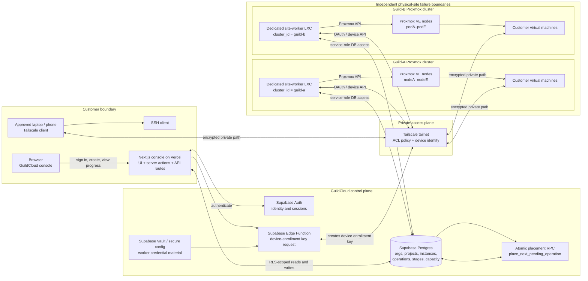
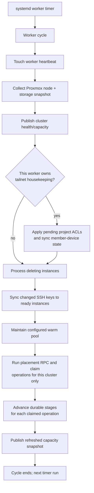
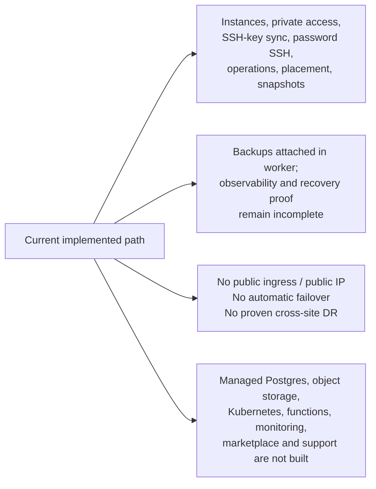

# GuildCloud internal architecture

**Purpose:** operating and design reference for the live private-cloud control
plane. This is an internal diagram set, not customer documentation. It explains
the implemented path and calls out important limits rather than describing the
future roadmap as if it existed.

**Read with:** [Project status](PROJECT_STATUS.md), the
[Phase 0 gap register](phase-0/gap-register.md), and the worker source in
[`deploy/site-worker/`](../deploy/site-worker/). Site capacity, worker
heartbeats, and admission state are live data; check the control plane before
using this document for an operational decision.

## 1. System boundary map



### Core boundary rule

The web application **never directly reaches a Proxmox private LAN**. A worker
inside each site executes the work. The worker is deliberately configured with
one `cluster_id`; it can only claim operations already assigned to that
cluster. This is the ownership boundary that prevents two clusters from
executing the same request.

## 2. Provisioning: request to Ready

```mermaid
sequenceDiagram
  autonumber
  actor User
  participant UI as Console UI
  participant CP as Supabase control plane
  participant Place as Placement RPC
  participant Worker as Site worker for selected cluster
  participant PVE as Proxmox VE
  participant TS as Tailscale API
  participant VM as New VM

  User->>UI: Choose project, image, size, access option
  UI->>CP: Create instance + durable operation + stages
  Note over CP: Instance is provisioning; operation is pending
  Worker->>CP: Publish cluster/node/storage health snapshot
  Worker->>Place: Claim next pending request
  Place->>CP: Check fresh capacity, admission, image/template, reservation
  Place-->>Worker: Operation stamped with one cluster, node, storage
  Worker->>PVE: Clone template and set requested resources
  PVE-->>Worker: VM created
  Worker->>PVE: Configure cloud-init and start VM
  Worker->>TS: Create VM device identity / auth key
  Worker->>VM: Install or start Tailscale and join private network
  Worker->>TS: Resolve VM device and private IP/hostname
  Worker->>CP: Save private hostname/IP and complete network stage
  Worker->>PVE: Check guest agent / reachability
  Worker->>CP: Mark operation succeeded; instance Ready
  CP-->>UI: Timeline and Connect card update
  UI-->>User: Copy private hostname and SSH command
```

### What the placement decision checks

The `place_next_pending_operation` RPC is the scheduler of record. It runs
inside Postgres under a transaction and uses an advisory lock to make the
low-volume placement decision atomic.

1. The cluster is enabled, open for admission, healthy enough, and recently
   observed.
2. A node has enough reserved CPU, memory, and storage headroom for the plan.
3. The selected OS image has a usable template on that cluster and node.
4. Node-local storage is handled as node-local: a `local-lvm` template must be
   cloned on its source node unless storage is shared.
5. A capacity reservation is written before the worker performs a clone.

The worker advances one durable stage at a time. The UI reads those stages;
the progress display is therefore a view of work, not an artificial timer.

| Durable stage | Worker responsibility | Customer-visible meaning |
| --- | --- | --- |
| `proxmox_api_call` | Clone or restore the VM and apply Proxmox resources. | Building your server. |
| `template_cloud_init` | Apply guest configuration and ensure the guest starts. | Preparing the operating system. |
| `network_access_attach` | Join private network, apply project policy, resolve device/IP. | Giving it private access. |
| `backup_monitoring_attach` | Attach the selected protection configuration. | Turning on protection. |
| `automated_verification` | Confirm the guest can answer expected checks. | Checking it is working. |
| `ready` | Release reservation and publish the terminal result. | Server is ready to use. |

## 3. Private access and the Tailscale enrollment path

```mermaid
sequenceDiagram
  autonumber
  actor User
  participant Console as GuildCloud console
  participant Enroll as enroll-device Edge Function
  participant DB as Supabase membership/token record
  participant Route as /api/enroll/[token]
  participant TS as Tailscale API
  participant Laptop as Customer device
  participant VM as Ready Guild Instance

  Note over User,VM: This flow is available after the instance is Ready and the Connect card has a private hostname.
  User->>Console: Select “Get my device connection command”
  Console->>Enroll: Request enrollment command for signed-in member
  Enroll->>TS: Create scoped, reusable device auth key
  Enroll->>DB: Store expiring enrollment token for that membership
  Enroll-->>Console: curl command with tokenized GuildCloud URL
  Console-->>User: Copy command (valid for up to 90 days)
  User->>Laptop: Run command in local terminal
  Laptop->>Route: Request tokenized install script
  Route->>DB: Redeem token and retrieve enrollment material
  Route-->>Laptop: Install Tailscale if needed; run tailscale up
  Laptop->>TS: Authenticate device into tailnet
  TS-->>Laptop: Private device identity and routes
  Laptop->>TS: SSH to private hostname
  TS->>VM: Encrypted private connection
  VM-->>User: SSH session
```

### Access control model

- There is no public IP or inbound public SSH route for a Guild Instance.
- Project membership and `access_grants` decide the intended access scope.
- A single worker deployment is the **tailnet housekeeping owner**, avoiding
  concurrent edits to the shared Tailscale ACL policy.
- The enrollment command is a bearer credential. It is reusable for the
  member's devices until expiry or explicit regeneration; it must not be sent
  in email, ticket comments, or chat.
- A new enrollment command retires the preceding one. Removing a member
  triggers the device-revocation path as best effort.

## 4. Lifecycle and reconciliation loop



The reconciliation work is as important as creates: it removes a deleted VM
and its Tailscale device, synchronizes changed SSH keys, refreshes observed
capacity for safe placement, and advances retryable work without assuming a
previous attempt finished.

## 5. State ownership

| Domain | Source of truth | Writer(s) | Notes |
| --- | --- | --- | --- |
| Identity, organizations, projects, access grants | Supabase Postgres + Auth | Console server actions under RLS | Customer-facing control plane. |
| Operations and stage timeline | `operations`, `operation_stages` | Console creates intent; site worker advances it | Durable history for progress and failures. |
| Placement and reservation | Placement RPC + capacity tables | RPC only | Workers consume a stamped placement; they do not choose another cluster. |
| VM runtime and clone tasks | Proxmox VE | Site worker through scoped API token | Real physical execution plane. |
| Private device and VM identity | Tailscale | Enrollment function and site worker | Project ACL policy is shared-tailnet configuration. |
| One-time server password | Supabase Vault until reveal | Instance creation + reveal RPC | Reveal once; do not log or retain plaintext. |

## 6. Operational limits and intentionally unbuilt boundaries



Do not infer HA, geographic failover, public ingress, or comprehensive
monitoring from the presence of multiple clusters. Each site is an independent
failure boundary. Tailscale provides private reachability; it does not replace
backup verification, replication, or recovery orchestration.

## 7. Incident triage: follow the failing boundary

| Symptom | First boundary to inspect | Evidence |
| --- | --- | --- |
| Request stays pending | Placement/capacity | Operation assignment, cluster admission, fresh node/storage snapshot, reservation. |
| Build fails early | Template/storage/Proxmox | Stage error, selected node/storage, Proxmox task log. |
| VM builds but has no Connect details | Guest network attach | `network_access_attach` stage, guest agent, Tailscale device registration, project ACL state. |
| Device cannot reach a Ready VM | Enrollment and policy | Member enrollment status, Tailscale device, access grant, private hostname. |
| Delete remains in progress | Reconciliation worker | Instance deletion state, worker heartbeat, VM ID, Tailscale device ID. |
| Wrong cluster handles work | Worker ownership | `operations.cluster_id`, worker `WORKER_CLUSTER_ID`, placement claim mode. |

## Code map

- Console intent and lifecycle actions:
  [`app/console/instances/actions.ts`](../app/console/instances/actions.ts)
- Private device enrollment:
  [`app/console/networking/actions.ts`](../app/console/networking/actions.ts),
  [`app/api/enroll/[token]/route.ts`](../app/api/enroll/%5Btoken%5D/route.ts)
- Generic per-cluster worker:
  [`deploy/site-worker/index.js`](../deploy/site-worker/index.js)
- Placement policy and clone routing:
  [`deploy/site-worker/placement-policy.js`](../deploy/site-worker/placement-policy.js),
  [`deploy/site-worker/routing.js`](../deploy/site-worker/routing.js)
- Atomic multi-cluster scheduler:
  [`supabase/migrations/20260818100000_add_atomic_placement_rpc.sql`](../supabase/migrations/20260818100000_add_atomic_placement_rpc.sql)
